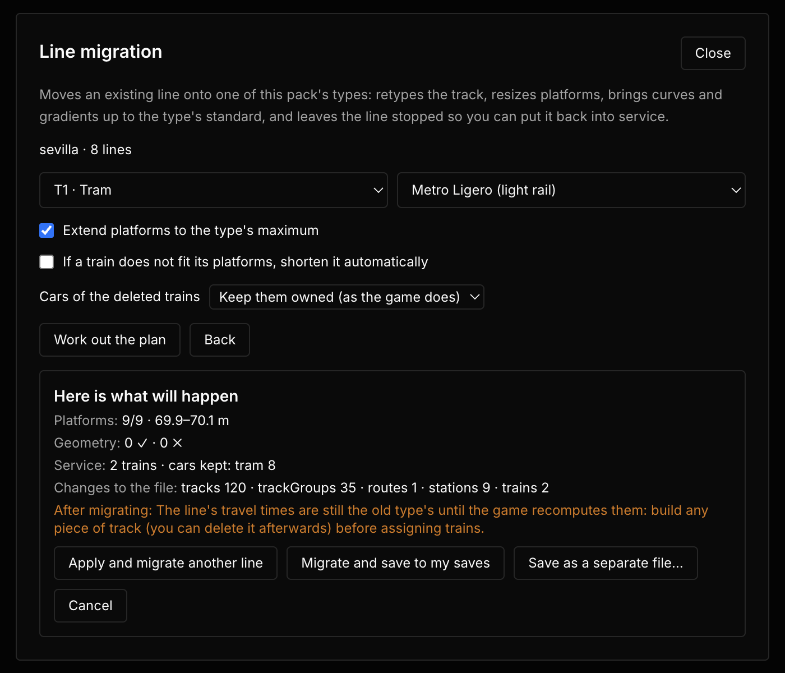

# Madrid Transit Pack

**[EN]** Four standardized Madrid train types for Subway Builder, one per real network — narrow-profile Metro, wide-profile Metro, Metro Ligero and Cercanías — with real-world specs (speeds, gradients, curve radii, platform lengths) taken from official technical norms and as-built project records. One type per *network* instead of per-model means branches and track sharing between lines of the same network just work.

**[ES]** Cuatro tipos de tren estandarizados de Madrid para Subway Builder, uno por red real. Al estandarizar por red en lugar de por modelo, los ramales y las vías compartidas entre líneas de la misma red funcionan sin conflictos de compatibilidad.

## Tipos incluidos / Included types

| ID | Red | Material de referencia | Velocidad | Composición | Pendiente máx. | Radio mín. |
|---|---|---|---|---|---|---|
| `madrid-metro-estrecho` | Metro L1-L5 + Ramal | CAF Serie 3000 | 80 km/h | 4 o 6 coches de 14,9 m (59,6-89,4 m) | 5,2 %¹ | 90 m (histórico)² |
| `madrid-metro-ancho` | Metro L6-L12 | Serie 8000 (ver nota³) | 110 km/h | 3 o 6 coches de 18,15 m (andenes hasta 115 m) | 4,0 %¹ | 250 m³ |
| `madrid-metro-ligero` | ML1-ML3 | Alstom Citadis 302 (versión Madrid: 2,40 m) | 70 km/h | 1-2 unidades de 32,16 m (186 plazas) | 6,5 %⁴ | 25 m |
| `renfe-cercanias` | Cercanías Madrid | Renfe S/452 (Alstom X'Trapolis) | 140 km/h | 1-2 unidades de 6 coches (100/200 m) | 3,5 % | 250 m⁵ |

¹ **En el juego la pendiente máxima es un permiso de construcción, así que va el techo real de la red y no el criterio de proyecto.** MM-DT-0-01 fija 35 ‰ (3,5 %) en proyecto, pero el Ramal Ópera–Príncipe Pío circula comercialmente al 52,06 ‰ (5,2 %) con material de gálibo estrecho, y el gran perfil usa el 4 % «excepcional» en la prolongación de L7 a Pitis (paso bajo la M-30), en la conexión L8–L10 y en L9 Pavones–Puerta de Arganda. Con 3,5 % no se podría reconstruir ninguno de los dos tramos. Datos de memorias de proyecto sin enlace público localizado.
² MM-DT-0-01 exige 300 m en líneas nuevas y 210 m en ampliaciones; el tipo estrecho conserva los ~90 m de las curvas históricas de L1-L5 para poder trazar por el casco antiguo.
³ Radio excepcional documentado en la memoria de la conexión L8–L10, que lo concede para «material tipo 5000» — no explícitamente para las 8000/9000. Y las cotas del tipo (18,15 m y ~200 plazas por coche) cuadran con la **Serie 8000**, cuyas composiciones de 6 coches miden ~108,8 m con ~1.270 plazas; la 9000 de AnsaldoBreda tiene medidas algo distintas.
⁴ Estimación: los Citadis admiten del 6 al 8 %, pero no hay cifra oficial publicada de ML1-ML3.
⁵ Criterio propio. El mínimo ETI para líneas nuevas de ancho ibérico es 150 m; no se ha localizado una cifra oficial única para Cercanías Madrid.

**Radio en estación:** las cuatro redes exigen curvas de radio ≥ 300 m en los andenes. En los dos tipos de metro esa cifra sale del radio de diseño de MM-DT-0-01 — *no* de las ETI, que **excluyen de su ámbito a metros y metros ligeros** (las versiones anteriores de este README lo atribuían mal). En Cercanías es criterio propio: las ETI no establecen ninguna regla de 300 m para andenes en curva.

## Procedencia de los datos

- **Reales y citados**: dimensiones, velocidades, capacidades y composiciones del material; radios de proyecto de 210/300 m (MM-DT-0-01); entrevía convencional ibérica de 3,808 m (Instrucción Técnica del Gálibo, 1985); aceleración lateral de 1,0 m/s², el máximo excepcional de insuficiencia de peralte de las ETI/ADIF (el valor normal es 0,65).
- **Derivados de datos oficiales**: entrevía del metro (~3,30 / 3,60 m, deducida del gálibo de túnel de 6,86 y 7,74 m). En Cercanías, `carLength` 16,67 m y `capacityPerCar` 151 son **promedios de la unidad** (100 ÷ 6 y 906 ÷ 6), no cotas por coche: la S/452 mezcla coches de uno y de dos pisos. El `capacityPerCar` del Metro Ligero es igualmente por unidad Citadis completa.
- **Declarados sin enlace verificable**: las pendientes reales del 5,2 % (Ramal) y del 4 % (gran perfil), de memorias de proyecto cuyos enlaces no se han localizado; el radio de 250 m del gran perfil; la aceleración de arranque del gran perfil y del Citadis; la pendiente y el radio de estación del Metro Ligero; los radios de 250 m de vía y 300 m de andén de Cercanías.
- **Equilibrio de juego**: costes de construcción, tph (42, elección del autor) y tiempos de parada. El mantenimiento, en cambio, **sí** está a la par de los tipos vanilla desde la v0.10.0 — ver más abajo.
- **Convención de este mod, no dato corporativo**: los colores. El azul institucional de Metro de Madrid es único (Pantone 286 C) y **no existe un celeste corporativo** ni ninguna distinción cromática oficial entre gálibo estrecho y gran perfil. El par azul/celeste de aquí existe solo para poder distinguir las dos redes en el mapa del juego.

> **Aviso para quien verifique estos datos:** el tipo de Cercanías modela la **Serie 452** (140 km/h, 100 m, ~905 plazas por unidad), no la **450** (759 plazas, 106-159 m). Una revisión previa de este pack lo auditó contra la 450 y marcó como erróneos varios valores que son correctos para la 452.

Detalles con sabor real: el perfil estrecho sale más barato de tunelar por el gálibo reducido (6,86 m), el Metro Ligero puede circular por la calle y cruzar a nivel, la S/452 conserva su caja de 3,10 m (16 cm más ancha que un Civia) y ~905 plazas por unidad de 100 m, con 2 coches de dos pisos.

## Instalación / Install

Copia la carpeta `madrid-transit-pack` en el directorio de mods de Subway Builder y actívalo en ajustes:

- **macOS**: `~/Library/Application Support/metro-maker4/mods/`
- **Windows**: `%APPDATA%/metro-maker4/mods/`

## Migración de líneas / Line migration (v0.12.0)

**[ES]** El pack incluye una herramienta que **migra líneas existentes a otro tipo de tren de verdad** — lo que el conversor del juego (flag `ROUTE_TYPE_CONVERSION`) no hace, porque solo reetiqueta y aborta si un andén se queda corto por centímetros.

- **Dónde**: en el **menú de inicio** (botón «Migrar líneas»), con la partida sin cargar. El panel de la barra dentro de la partida es solo diagnóstico: te dice, por línea y destino, si el tren cabe físicamente y cuántas vías incumplen radio o pendiente, y trae un atajo para encender el flag del conversor del juego.
- **Qué hace**: retipa la vía y sus grupos completos; lleva los **andenes al máximo del tipo destino** (solo los acorta si lo superan) redistribuyendo el trazado existente, sin inventar geometría; **regenera las bretelles** con el generador exacto del juego y las ensancha si el radio del destino no cabe en su ventana; adapta curvas y pendientes que incumplan la norma del tipo (con la regla real de estación: desnivel ≤ 0,1 m); **borra los trenes** de la línea y la deja parada (0 trenes, sin horario); y escribe una **partida nueva** — jamás pisa la original.
- **Flota**: por defecto los coches de los trenes borrados **se conservan en propiedad**, igual que hace el juego (no cuestan mantenimiento). Opcionalmente se reembolsan a precio de compra.
- **Líneas que comparten vía o estación** (p. ej. dos Cercanías por el mismo corredor): la herramienta lo detecta y ofrece migrar **todas juntas al mismo destino, o ninguna**.
- **Si algo no se puede resolver** (un andén donde el tren no cabe, una curva imposible dentro de la correa de 15 m, una bretelle quad), se lista en el plan y el botón de migrar solo se desbloquea con una casilla de aceptación explícita. Con la casilla de «bajar coches», las composiciones que no quepan se reducen automáticamente a las que sí.
- **Varias líneas**: «Aplicar y migrar otra línea» encadena migraciones en memoria y escribe **un solo fichero** al final (p. ej. `sevilla-T1+T2-metro-ligero`).
- **Después de migrar**: construye un tramo de vía cualquiera (puedes borrarlo después) antes de asignar trenes — eso hace que el juego recalcule recorridos y tiempos, que hasta entonces siguen siendo los del tipo antiguo. La miniatura y la cámara se regeneran al primer guardado; si la partida original tenía timelapse, sus fotogramas no se conservan.

**[EN]** The pack ships a tool that **actually migrates existing lines to another train type** — which the game's converter (the `ROUTE_TYPE_CONVERSION` flag) does not: it only relabels, and aborts if any platform is centimetres too short.

- **Where**: in the **main menu** ("Migrate lines" button), with no save loaded. The in-game toolbar panel is diagnosis only: per line and target it tells you whether the train physically fits and how many tracks violate the target's radius or gradient, plus a shortcut to turn on the game's converter flag.
- **What it does**: retypes the track and its full groups; brings **platforms to the target type's maximum** (only shortens those above it) by redistributing existing alignment — no invented geometry; **regenerates crossovers** with the game's exact generator, widening their window when the target radius needs it; conforms curves and gradients to the type's standard (including the real station rule: ≤ 0.1 m of level difference); **deletes the line's trains** and leaves it stopped; and writes a **new save** — never over the original.
- **Fleet**: by default the deleted trains' cars **stay owned**, as the game itself behaves (owned stock has no upkeep). Optionally they are refunded at purchase price.
- **Lines sharing track or stations**: detected; you migrate **all of them to the same target, or none**.
- **Anything unsolvable** is listed in the plan, and the migrate button only unlocks behind an explicit acceptance checkbox. The "shorten trains" option reduces consists that would not fit.
- **Several lines**: \u201cApply and migrate another line\u201d chains migrations in memory and writes **a single file** at the end (e.g. `sevilla-T1+T2-metro-ligero`).
- **After migrating**: build any piece of track (you may delete it afterwards) before assigning trains — that makes the game recompute routes and timings, which until then remain those of the old type. Thumbnail and camera regenerate on first save; timelapse frames are not kept.

## Fuentes / Sources

- [Norma MM-DT-0-01 'Geometría de Vía' — Metro de Madrid](https://www.alamys.org/wp-content/uploads/2021/04/Normativa-T%C3%A9cnica-B%C3%A1sica-de-V%C3%ADa-Metro-Madrid-2017.pdf) (radios mínimos 300/210 m, pendiente máxima 35 ‰, 110 km/h de diseño, pendiente nula en estaciones)
- [Proyectos de trazado ADIF/Mitma](https://cdn.mitma.gob.es/portal-web-drupal/estudio_ferrocarriles/astigarraga_lezo/memoriayanejos/07._trazado_y_superestructura_vf.pdf) (criterios de trazado en ancho ibérico. **Corrección respecto a versiones anteriores de este README:** las ETI fijan 150 m de radio mínimo en líneas nuevas y **no** establecen los 300 m de andén en curva que se les atribuía; además excluyen de su ámbito a metros y metros ligeros)
- [Serie 3000 — Wikipedia](https://es.wikipedia.org/wiki/Serie_3000) · [Vía Libre](https://vialibre-ffe.com/noticias.asp?not=509) (aceleración 1,0 m/s², composiciones de 59,94/89,38 m, 734 plazas)
- [Serie 8000 — Wikipedia](https://es.wikipedia.org/wiki/Serie_8000) · [Series 7000 y 9000 — Wikipedia](https://es.wikipedia.org/wiki/Series_7000_y_9000)
- [Serie 452 de Renfe — Wikipedia](https://es.wikipedia.org/wiki/Serie_452_de_Renfe) · [Geotren](https://www.geotren.es/blog/los-nuevos-trenes-de-cercanias-y-de-media-distancia-de-renfe/) · [Alstom](https://www.alstom.com/press-releases-news/2021/3/alstom-manufacture-152-high-capacity-xtrapolis-commuter-trains-spanish-operator-renfe) (140 km/h, 905 plazas/100 m, caja de 3,10 m)
- [Dossier Metros Ligeros de Madrid — Vía Libre](https://vialibre-ffe.com/pdf/madrid_dossier526.pdf) (Citadis 302 versión Madrid: 32,156 m × 2,40 m, 186 plazas, 750 V, 70 km/h)
- [Metro de Madrid — Trenvista](https://www.trenvista.net/encarrilando/la-gran-diversidad-del-metro-de-madrid/) (andenes de 60/90/115 m y gálibos)

## Costes y equilibrio de juego

Los costes de construcción y algunos parámetros de juego (tph, coste de estaciones y de vía) están equilibrados contra los tipos vanilla de Subway Builder, no son datos reales.

**El motor no admite curvas de coste por tipo.** Hasta la v0.10.0 tres de los cuatro tipos declaraban `elevationMultipliers` para que, por ejemplo, el túnel de gálibo estrecho costase menos que el de gran perfil. Subway Builder **no lee ese campo**: la cadena aparece dos veces en todo el binario de la 1.6.0 y ambas son el dato del tranvía vanilla, y el parámetro de tipo de tren de `getElevationMultiplier` es vestigial. Los cuatro tipos cobran siempre la misma tabla global (`4,5 / 2 / 1 / 0,5 / 0,35 / 0,5 / 0,8` de bore profundo a viaducto), así que la única diferencia real de coste entre redes es su `baseTrackCost`. Los bloques se han retirado en la v0.12.0 para que el código no prometa lo que el juego no cumple.

### Mantenimiento a paridad vanilla (desde v0.10.0)

El motor define `MAINTENANCE_COST_MULTIPLIER = 2` **incrustado dentro de las definiciones de los tipos vanilla**, y no lo aplica a los tipos que registran los mods. Hasta la v0.9.4 este pack usaba los valores sin doblar, así que sus cuatro redes costaban entre el 44 % y el 67 % de mantener que su equivalente del juego base — y la estación de Cercanías, un 15,6 %, pese a costar 63,75 M€ construirla. Desde la v0.10.0 van ya a la par:

| Tipo | Vía €/m | Estación €/año | Referencia vanilla |
|---|---|---|---|
| `madrid-metro-estrecho` | 320 | 280.000 | `heavy-metro` (360 / 320.000), algo por debajo por el gálibo reducido |
| `madrid-metro-ancho` | 360 | 320.000 | `heavy-metro`, paridad exacta |
| `madrid-metro-ligero` | 240 | 50.000 | `tram` (240 / 40.000), estación algo mayor |
| `renfe-cercanias` | 300 | 320.000 | `commuter-rail`, paridad exacta |

⚠️ **Si vienes de la v0.9.4 con una partida en curso**, el mantenimiento sube ×2 en las cuatro redes. En Cercanías la estación sube ×6,4 (50.000 → 320.000), aunque el total de una línea realista queda en el mismo orden que el resto: 12 estaciones y 25 km pasan de 5,60 a 11,34 M€/año (×2,02), porque la vía domina el gasto.

## Aviso importante / Important warning

**[ES]** Si construyes líneas con estos tipos y después desactivas o desinstalas el mod, **esa partida deja de cargar**. El juego resuelve el tipo de tren por id y no tiene reserva para uno desconocido: la carga aborta a medias con «Error loading save». No hay reparación posible desde el juego. Antes de quitar el mod, pasa esas líneas a un tipo del juego base con el conversor del propio juego (flag `ROUTE_TYPE_CONVERSION`; el panel del pack trae un atajo para encenderlo) o guarda una copia.

**[EN]** If you build lines with these types and later disable or uninstall the mod, **that save will no longer load**. Train types resolve by id and there is no fallback for an unknown one: the load aborts halfway with "Error loading save", and the game offers no repair path. Move those lines to a built-in type with the game's own converter (the `ROUTE_TYPE_CONVERSION` flag; the pack's panel has a shortcut to enable it), or keep a backup, before removing the mod.

## Créditos / Credits

- Las stats del tipo Cercanías parten del modelo "Series 452" del pack [danTrains](https://github.com/DanielD1909/danTrains) de **DanielD1909** (MIT), verificadas y ajustadas después contra las fuentes reales de arriba.

## Licencia

MIT — ver [LICENSE](LICENSE).
